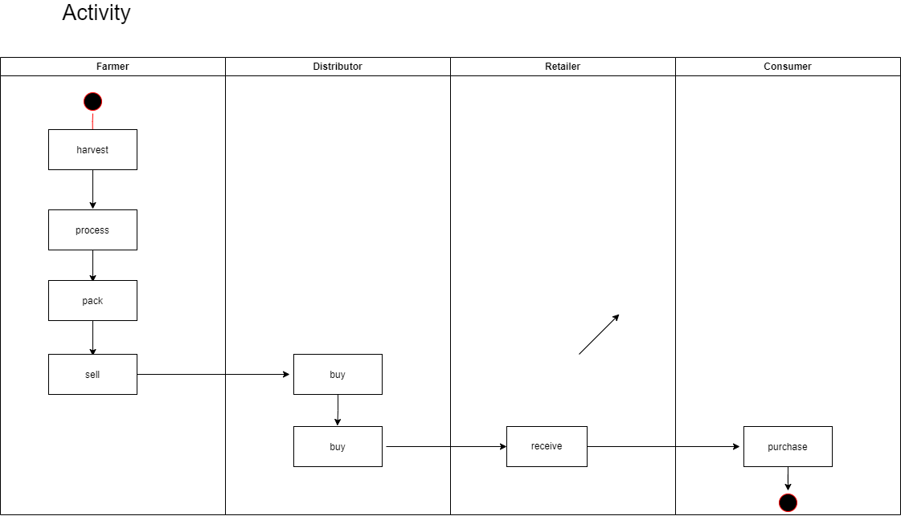
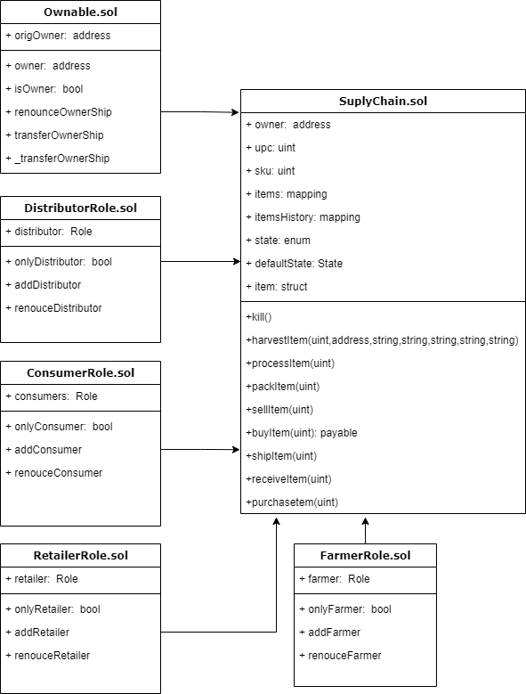
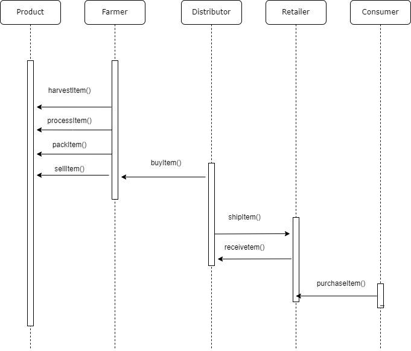
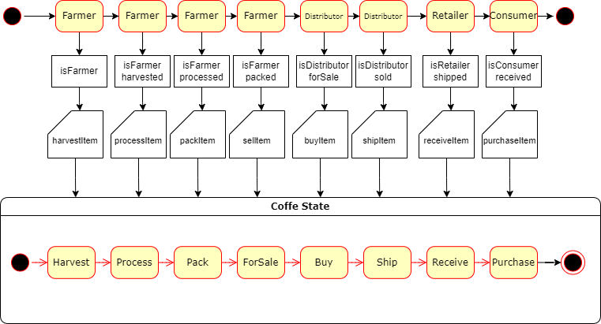
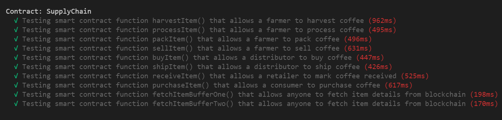

# Private Blockchain Application

## 1 - Activity

  

## 2 - Classes

  

## 3 - Sequence

  

## 4 - State

  

## 5 - Test

  

## 6 - Truffle

  Truffle v4.1.14 (core: 4.1.14)

## 7 - Solidity

  Solidity v0.4.24 (solc-js)

## 8 - Node

  Node 12.16.3

## NO use IPFS

## Deployed to Rinkeby

 https://rinkeby.etherscan.io/address/0xd38becda2574b1f35a0c9c1ccfde75c29568d6cf